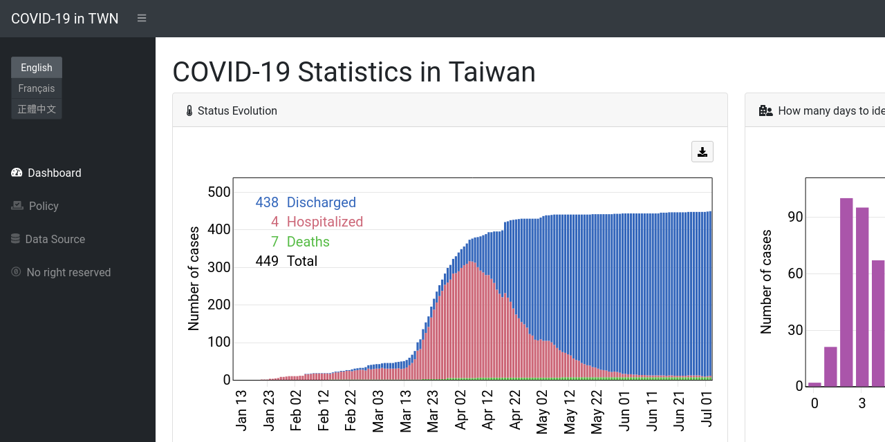

COVID-19 Statistics in Taiwan
=============================

This repository hosts and generates a [dashboard](https://linc-tw.github.io/COVID_breakdown/index.html) for COVID-19 statistics in Taiwan.

Description
-----------

The goal of this project is to inform general public about COVID-19 with data visualization. 
It allows users to monitor the situation in Taiwan and to ponder over epidemic prevention policies.

This project is driven by 3 key motivations:
- Taiwan is one of the rare countries where the infection is low enough to make detailed case-tracing possible;
- the basic information from case-tracing is publicly available; and 
- the scientific potential of this breakdown dataset has not yet been fully exploited.

Features
--------

So far, 7 plots can be found on Dashboard:
- Status Evolution
- Number of Tests by Reporting Criterion
- Confirmed Cases by Transmission Type
- Confirmed Cases by Detection Channel
- Correlations between Travel History & Symptoms
- Correlations between Age & Symptoms
- How many days to identify cases? (day difference between report date & entry/onset date)

And one is on Policy:
- Chronology of Systematic Testing

Some other ideas have been proposed at [Issues](https://github.com/Linc-tw/COVID_breakdown/issues).

Language support
----------------

- English
- French
- Taiwanese Mandarin

Current workflow
----------------

`upload.sh` is automatically executed everyday around 3:15pm Taipei time. It will:
- download raw data from the original dataset (a publicly accessible online Google worksheet);
- execute `python COVID_breakdown_data_processing.py` to generate processed data; and
- commit & push the data to the repository.

Credits
-------

The [original dataset](https://docs.google.com/spreadsheets/d/e/2PACX-1vRM7gTCUvuCqR3zdcLGccuGLv1s7dpDcQ-MeH_AZxnCXtW4iqVmEzUnDSKR7o8OiMLPMelEpxE7Pi4Q/pubhtml#) 
is maintained by various anonymous users of the PTT forum, often considered as Taiwanese Reddit.
They collect information from daily press releases and conferences, and sort them into comprehensive worksheets.

Obviously this project cannot be done without the goodwill of these volunteers that I am fully grateful to.

Licenses
--------

The codes & scripts are released under MIT License © Chieh-An Lin.

This repository contains a [piece of code](https://github.com/Linc-tw/COVID_breakdown/blob/master/js/saveSvgAsPng.js) 
taken from [here](https://github.com/exupero/saveSvgAsPng) and is released under [MIT License © Eric Shull](https://github.com/exupero/saveSvgAsPng/blob/gh-pages/LICENSE).

The website template is released under [MIT License © Blackrock Digital LLC](https://github.com/BlackrockDigital/startbootstrap-sb-admin/blob/gh-pages/LICENSE).

All other texts and plots created by this repository are released under [CC0 1.0 Universal Public Domain Dedication](https://creativecommons.org/publicdomain/zero/1.0/deed.en).

