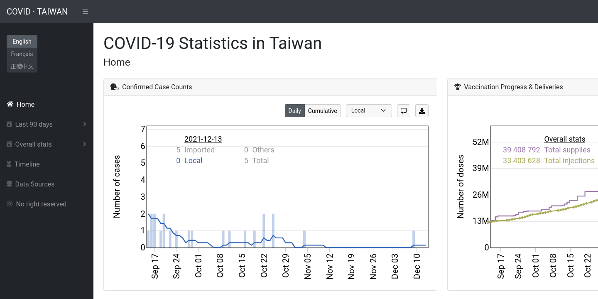

COVID-19 Statistics in Taiwan
=============================

This repository hosts and generates a [dashboard](http://covidtaiwan.linc.tw/) for COVID-19 statistics in Taiwan.

Description
-----------

This site informs general public about COVID-19 with data visualization.
It shows cases, testing, & vaccination statistics in Taiwan.

Features
--------

The most recent statisitcs can be found in _Last 90 days_.
The overall statistics can be found in _Overall stats_.
Each of these two sections contains 5 pages: 
- _Case breakdown_
- _Incidence rates_
- _Vaccination_
- _Other stats_
- _Comparison_

Plots on [_Case breakdown_](http://covidtaiwan.linc.tw/page/latest_cases.html) are:
- Confirmed Case Counts (also shown in [_Home_](http://covidtaiwan.linc.tw/page/index.html))
- Local Confirmed Cases per City & County
- Confirmed Cases by Age

Plots on [_Incidence rates_](http://covidtaiwan.linc.tw/page/latest_incidence.html) are:
- Arrival & Local Incidence Rates
- Incidence Map
- Evolution of Incidence Rate by City & County (only in _Last 90 days_)
- Evolution of Incidence Rate by Age Group (only in _Last 90 days_)

Plots on [_Vaccination_](http://covidtaiwan.linc.tw/page/latest_vaccination.html) are:
- Vaccination by Brand
- Vaccination Progress & Deliveries (also shown in [_Home_](http://covidtaiwan.linc.tw/page/index.html))
- Vaccination Progress by Dose

Plots on [_Other stats_](http://covidtaiwan.linc.tw/page/latest_others.html) are:
- Test Counts
- Positive Rate & Case Fatality Rate
- Death Counts
- Border Crossing
- Infection Dynamics (only in _Overall stats_)

The plot on [_Comparison_](http://covidtaiwan.linc.tw/page/latest_comparison.html) is:
- Statistics in Mirror

And 2 other plots on the [_Timeline_](http://covidtaiwan.linc.tw/page/timeline.html) page:
- Chronology of Systematic Testing
- Pandemic Timeline (text in Mandarin)

Other ideas for plots are welcome. To be proposed at [Issues](https://github.com/Linc-tw/COVID_breakdown/issues).

Language support
----------------

- English
- French
- Taiwanese Mandarin

Current workflow
----------------

An automatic update is scheduled at 16:45 everyday.
This is done by executing `upload.sh`. It will:
- download raw data from the sources,
- execute `python python/COVID_process.py` to generate processed data, and
- commit & push the data to the repository.

Automatic updates can be interrupted when processing scripts raise errors (typically when data formats change) or when my computer is down.
Manual data regularization may be done from time to time.

Credits
-------

The principle data source of this website is 
maintained by various anonymous users of the PTT forum, often considered as Taiwanese Reddit. 
They crawl to harvest data from official sites. 
They also collect fragmental information from daily press releases and conferences, and sort them into comprehensive worksheets.

Obviously this website cannot be done without the goodwill of these volunteers that I am fully grateful to.

See [_Data Sources_](http://covidtaiwan.linc.tw/page/data_source.html) or 
`README.md` in [`raw_data/`](https://github.com/Linc-tw/COVID_breakdown/tree/master/raw_data)
for details.

Licenses
--------

The codes & scripts are released under MIT License © Chieh-An Lin.

This repository contains a [piece of code](https://github.com/Linc-tw/COVID_breakdown/blob/master/js/utility/saveSvgAsPng.js) 
taken from [here](https://github.com/exupero/saveSvgAsPng) and is released under [MIT License © Eric Shull](https://github.com/exupero/saveSvgAsPng/blob/gh-pages/LICENSE).

The website template is released under [MIT License © Blackrock Digital LLC](https://github.com/BlackrockDigital/startbootstrap-sb-admin/blob/gh-pages/LICENSE).

All other texts and plots created by this repository are released under [CC0 1.0 Universal Public Domain Dedication](https://creativecommons.org/publicdomain/zero/1.0/deed.en).
